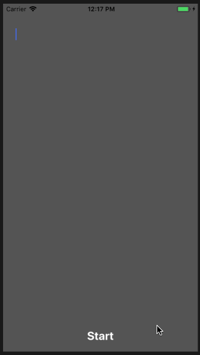

Email：pikacode@qq.com


# TypewriterView

A simple but usefull typewriter view subclass of `UITextView`.


## Screenshot




## Installation

	use_frameworks!
	target 'YourTargetName' do
	  pod 'TypewriterView'
	end


## Usage

##### Init

```swift
let typewriterView = TypewriterView(frame: frame)
```

##### Write

```swift
/* Write */
typewriterView.write("some content")
typewriterView.write("some content", speed: 0.05)

/* Cursor Blink */
typewriterView.cursorBlink()
typewriterView.cursorBlink("I", speed: 0.02, repeats: 5)

/* Pause/Resume */
typewriterView.pause()
typewriterView.resume()

/* Unod */
typewriterView.undo(15)
typewriterView.undo(20, speed: 0.02)
```

##### Clear/Stop

```Swift
/* Clear */
//clear text, but will not stop writing
typewriterView.clear()

/* Stop */
//stop writing right now, and discard unwrite contents
typewriterView.stop()

/* Discard Unwrite Contents */
//discard unwrite contents, but keeps writing current text
typewriterView.discardUnwriteContents()
```

##### Completion Block

```swift
/* Completion Block */
typewriterView.completionBlock = {
    doSomeThing()
}
```

##### Status

```Swift
/* Status */
typewriterView.isPausing
typewriterView.isFinished
```


 

 